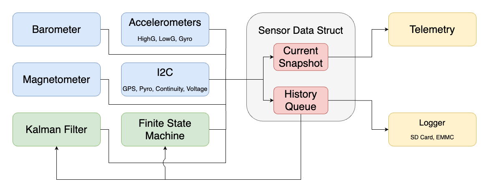

# Architecture
This document describes the architecture of the MIDAS software flight code, as well as 
rationales for some of its design decisions.

## Flight Code Structure

## Code Structure
The general architecture for the software is to have a central data structure which contains 
the current reading, as well as the previous readings, of each sensor. This central data structure
also contains the same combination of current and previous values for the FSM and Kalman Filter.
This architecture forces the threads to communicate exclusively through this central data structure
instead of directly or through globals. The primary reason for this is to facilitate thorough 
logging, as well as easing multicore coding. Additionally, the lack of globals means that running
two or more instances of flight code in the same process is possible, making SILSIM possible.

Speaking of threads: each component will have its own thread. That is to say, each sensor, 
the Kalman filter, the flight FSM, the SD card logger, etc... will run on its own thread 
and communicate via the central data structure. For example, the barometer will be on its 
own thread at its own speed, while telemetry will also have its own thread running at 
a slower speed. This helps ensure that we can maximize the amount of sensor readings by
reading from each sensor at the optimal speed. 

The threads are split into two cores: the SENSOR_CORE (Core 0), and the DATA_CORE (Core 1). 
This is so that the slower operations, data logging, telemetry, etc..., do not slow down 
faster operations, like getting sensor data. This split also means after the rocket has 
landed we can shut off Core 0 to save battery but still have GPS pings.
***

### `/src`

`main.cpp`: The entrypoint for real flight code (i.e. non-emulated). Sets up Serial, then 
calls into `systems.cpp`'s begin_threads with a handle to the hardware sensors.

`sensors.h`: Defines the protocol/interface of each sensor. Each sensor then must be implemented 
once in each of `/hardware`, `/hilsim`, and `/silsim`. This abstraction makes emulation much easier.

`systems.cpp`: Contains the code for all the threads. The `begin_thread` function is the real 
entrypoint for flight code, which first initializes each sensor and then begins all the threads.

`rocket_state.h`: Defines the aforementioned central data structure, which holds the current and
past values of each sensor as well as other data that should be logged.

`hal.h`: Defines macros to declare, start, and put to sleep different threads, as well as containing
some of the logic which switches between emulated and non-emulated modes. 

`sensor_data.h`: Declares the type of data each sensor should return.

Of the following three folders, only one will actually be compiled, depending on whether you're compiling
`mcu_main`, `mcu_silsim`, or `mcu_hilsim`. This lets us switch between emulated and non-emulated modes
very easily.

`/hardware`: A folder containing the implementation for each of the physical sensors on MIDAS.

`/silsim`: A folder containing the implementation of the sensor emulation used in SILSIM. SILSIM is a 
software simulation program that tests flight code by simulating a flight on your computer.

`/hilsim`: A folder containing the implementation of the sensor emulation used in HILSIM. HILSIM is a 
program that tests out flight code on the physical hardware. The difference between this and 
`/hardware` is that sensor data is calculated on your computer and sent to the hardware to test 
in HILSIM, but is taken from actual sensors in `/hardware`.

***

### `/libs`
All the libraries used which are not in the PlatformIO package manager.

***

`platformio.ini`: The build and upload configurations to use.

`README.md`: It's a readme, what do you expect?

## Development Guidelines

Do not use global, thread local, or static variables within the `/src` folder. All of this code 
will be shared and will very likely need to be instantiated multiple times in order to make 
multi-stage SILSIM work. Globals are permitted within the `/hardware` and `/hilsim` folders, 
since this code won't be used in SILSIM (in fact, globals are required within `/hardware` since 
there can only be a single instance of each sensor). Some SILSIM specific code may use globals,
like the single instance of the thread manager.
